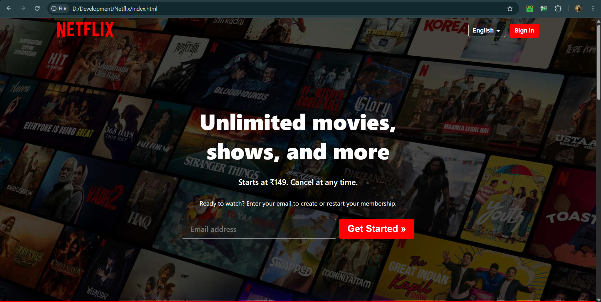
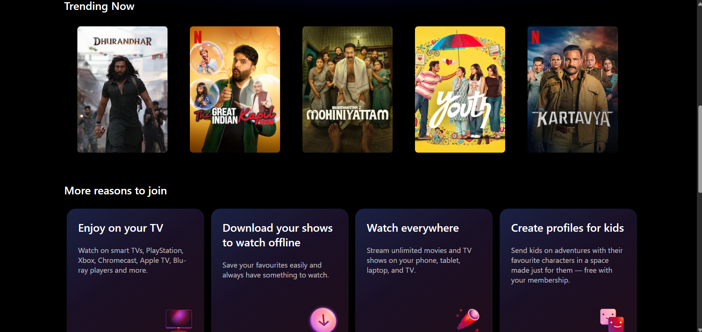
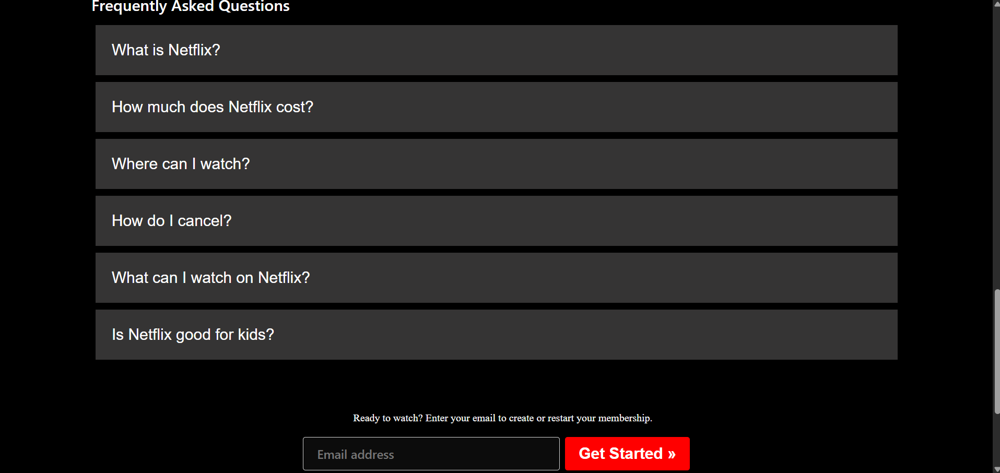
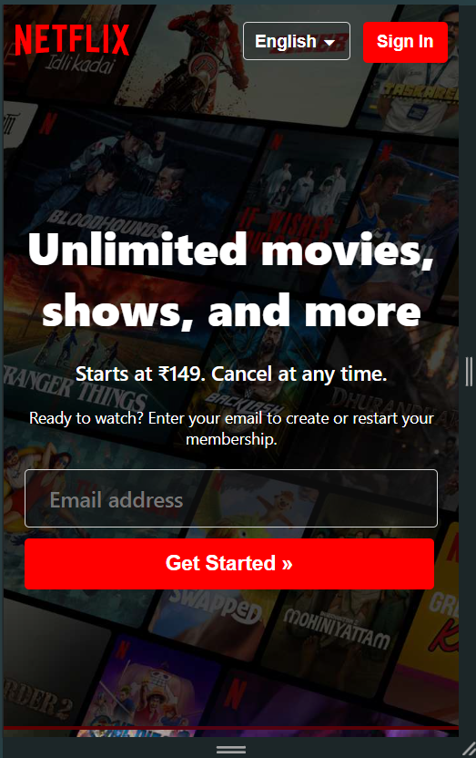
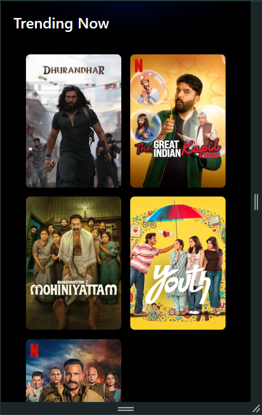
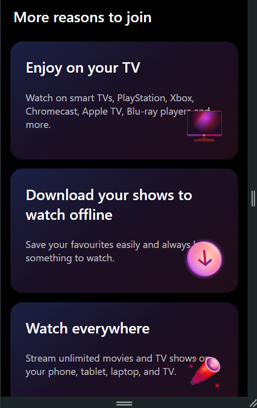
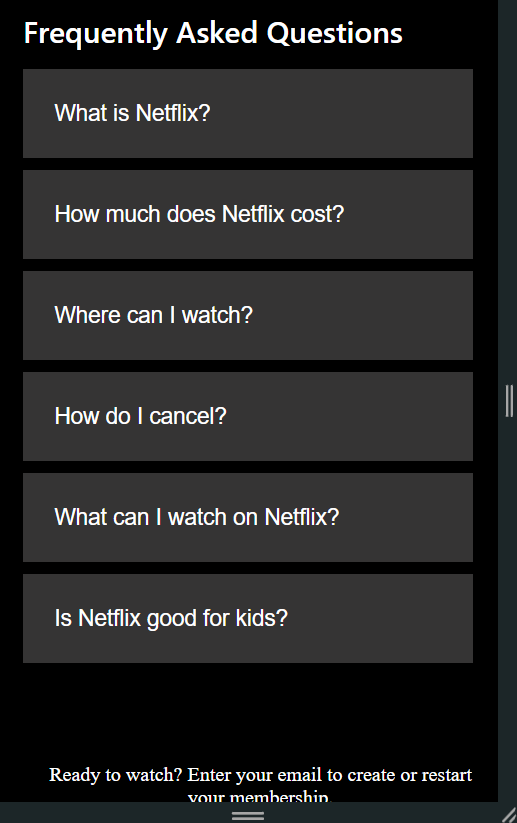

# Netflix Homepage Clone

A fully responsive Netflix-inspired homepage built using HTML and CSS. This project replicates the modern user interface of Netflix, including the hero section, navigation bar, feature highlights, FAQ section, and responsive layouts for different screen sizes.

## Features

- Responsive design for desktop, tablet, and mobile devices
- Netflix-inspired modern user interface
- Interactive hover effects
- Structured and reusable CSS styling
- Mobile-friendly navigation and layout
- Clean and organized project structure

## Tech Stack

- HTML5
- CSS3

## Screenshots

## Desktop View

## Mobile View

## What I Learned

- Building responsive layouts using CSS
- Working with Flexbox and Grid
- Creating modern UI components
- Improving code organization and maintainability
- Adapting designs for multiple screen sizes

## Author

Anurag Pawar